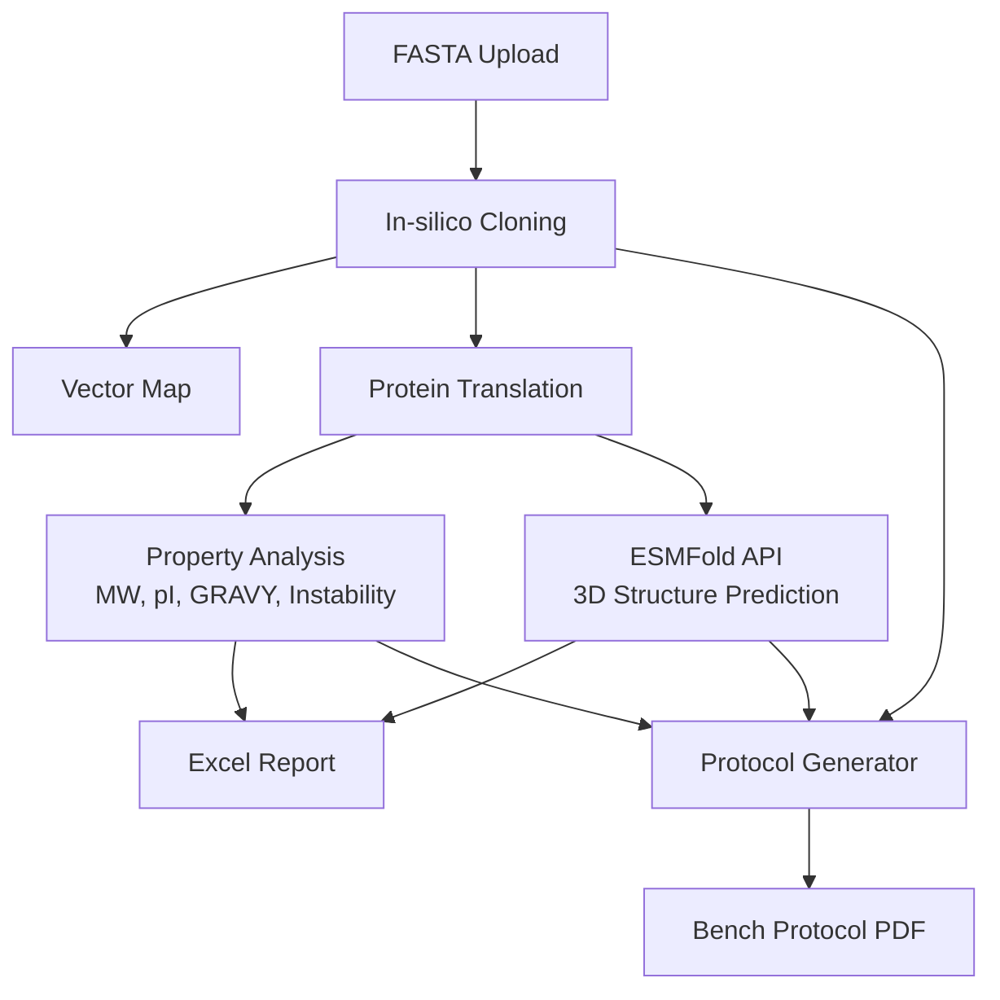

# Vector2Fold 🧬 — DNA Sequence to Protein 3D Structure & Bench Protocol Pipeline

[](https://<your-app>.streamlit.app/)

## 🌟 Overview

**Vector2Fold** is a web application that takes vector/gene DNA sequences as input and performs an end-to-end pipeline of protein translation, property analysis, AI-based 3D structure prediction (ESMFold), and **automatic bench protocol PDF generation** — all in one tool.

Designed for agricultural and biotech researchers, Vector2Fold lets you visualize whether your cloned sequence can fold into a stable 3D structure *before* committing to wet-lab experiments, and then generates a ready-to-use experimental protocol.

## 🧪 Key Features

### 🔬 In-silico Cloning
- Restriction enzyme analysis with unique-site detection
- Circular vector map visualization (insert + backbone)
- Enzyme condition display (buffer, overhang type, star activity risk)

### 🧪 Protein Analysis & 3D Structure
- DNA → protein translation
- Molecular weight (MW), isoelectric point (pI), GRAVY index, instability index
- ESMFold 3D structure prediction with pLDDT confidence scoring
- Interactive 3D viewer (py3Dmol, colored by pLDDT)
- 3-stage API fallback (verify=True → verify=False → error handling)
- Excel report export with vector map image

### 📋 Bench Protocol Auto-Generation (**NEW**)
- **PDF protocol output** modeled after professional reagent datasheets (e.g., TaKaRa PrimeSTAR Max)
- Auto-calculated PCR conditions based on insert length
- Primer Tm estimation with annealing time recommendation
- Restriction enzyme digestion protocol with buffer/overhang info
- Ligation protocol with insert amount calculation
- Transformation and colony screening steps
- Troubleshooting table
- Protein prediction summary with actionable recommendations

## 🏗 Architecture



## 📂 Repository Structure

```
Vector2Fold/
├── main.py                 # Streamlit application (UI + orchestration)
├── config.py               # Constants, enzyme DB, protocol parameters
├── protocol_generator.py   # PDF protocol generation module (fpdf2)
├── requirements.txt        # Dependencies
├── .gitignore
├── LICENSE                 # MIT License
└── README.md
```

## 🛠 Tech Stack

| Layer | Technology |
|-------|-----------|
| Frontend | Streamlit |
| Bioinformatics | Biopython, dna_features_viewer |
| AI Model | ESMFold (ESM-2) API |
| 3D Visualization | py3Dmol (direct HTML rendering) |
| Protocol PDF | fpdf2 |
| Report Export | XlsxWriter |
| Language | Python 3.12 |

### Design Principles
- **Graceful degradation**: ESMFold API uses 3-stage fallback; app remains functional even if API is unavailable
- **stmol-free**: 3D rendering uses `py3Dmol` + `streamlit.components.v1.html()` directly for Streamlit Cloud compatibility
- **Modular architecture**: Config, protocol generation, and UI logic are separated into distinct modules

## 🚀 Usage

1. Access the [deployed app](https://<your-app>.streamlit.app/)
2. Upload insert gene FASTA and vector backbone FASTA files
3. **In-silico Cloning tab**: Select restriction enzyme and insertion position
4. **Protein Analysis tab**: Run analysis to get MW/pI/3D structure
5. **Bench Protocol tab**: Generate downloadable PDF protocol

### Local Development

```bash
git clone https://github.com/TSUBAKI0531/Vector2Fold.git
cd Vector2Fold
pip install -r requirements.txt
streamlit run main.py
```

## 👤 Author

- **Name**: Sukeda Masaki
- **Degree**: Ph.D. in Agriculture (Fish Immunology, Kyushu University)
- **Background**: NGS analysis, antibody drug R&D
- **Interests**: Bioinformatics / Python-based analysis tool development

## 📄 License

This project is licensed under the MIT License - see the [LICENSE](LICENSE) file for details.
