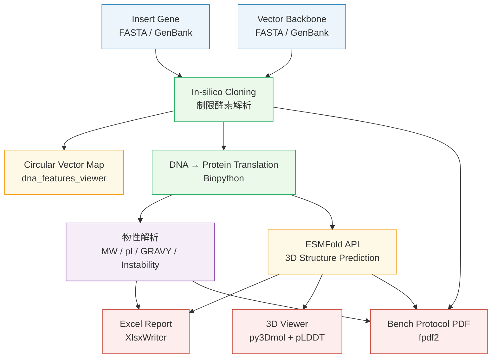

# Vector2Fold

FASTA/GenBankファイル2本を渡すだけで、in silicoクローニング・タンパク質物性解析・ESMFold 3D構造予測・ベンチプロトコルPDF生成までをワンストップで完結させるStreamlit Webアプリ。

---

## 解決した課題

遺伝子を発現ベクターに組み込んでも、コードされるタンパク質が「折り畳まれた構造」を持つかどうかは、発現・精製を経るまで確認できなかった。クローニング設計のたびに制限酵素マップツール・翻訳ツール・構造予測サーバー・プロトコル作成スプレッドシートを行き来する手間も大きく、計算ミスや転記エラーが生じやすかった。

Vector2Foldは「ベクターと遺伝子のFASTAをアップロードするだけ」で制限酵素解析から3D構造予測、ベンチ用実験手順書の出力まで一貫して実行する。ESMFoldのpLDDTスコアで折り畳み信頼度を事前評価でき、発現候補の優先順位付けを実験着手前に行えるようにした。

---

## 主要機能

- **In-silico クローニング** — Biopython `AllEnzymes` による制限酵素ユニークサイト検索と挿入位置指定。`dna_features_viewer` でバックボーン・インサート・制限酵素サイトを色分けしたサーキュラーベクターマップを表示
- **タンパク質物性解析** — DNA配列を自動翻訳し、分子量（MW）・等電点（pI）・GRAVYインデックス・不安定性指数（Instability index）を `Biopython ProteinAnalysis` で一括算出
- **ESMFold 3D構造予測** — Meta ESMFold APIを呼び出し、pLDDT信頼度スコア付きPDB構造を取得。py3DmolによるインタラクティブなpLDDTグラデーション3Dビューア内蔵
- **Excelレポート出力** — サマリー数値・配列・ベクターマップ画像を1ファイルに統合したXlsxWriter製レポートをダウンロード
- **ベンチプロトコルPDF自動生成** — PCR条件（インサート長→伸長時間自動算出）・制限酵素消化・ライゲーション（挿入量計算式付き）・トランスフォーメーション・コロニースクリーニング・トラブルシューティング表を含む多ページPDFをfpdf2で出力

---

## Live Demo

Streamlit Cloudにデプロイ済みのため、インストール不要で動作確認できます。

🚀 **[Live Demo](https://vector2fold-adrzhbghx3suvqpsgpj9se.streamlit.app/)**

インサート遺伝子のFASTAファイルとベクターバックボーンのFASTA/GenBankファイルをサイドバーからアップロードして試せます。

---

## 技術スタック

| カテゴリ | 使用技術 |
|---|---|
| Web UI | Streamlit（session_state 管理・3タブ構成） |
| バイオインフォマティクス | Biopython — `AllEnzymes`（制限酵素解析）、`ProteinAnalysis`（物性計算）、`SeqIO` |
| ベクターマップ可視化 | dna_features_viewer — `CircularGraphicRecord` による環状マップ |
| 3D可視化 | py3Dmol + `streamlit.components.v1.html()` — pLDDTグラデーション表示 |
| 構造予測 | ESMFold API（ESM Atlas / Meta）— SSL 2段階フォールバック |
| プロトコルPDF | fpdf2 — `ProtocolPDF` カスタムクラス（Helveticaフォント） |
| レポート出力 | XlsxWriter — ベクターマップ画像埋め込み Excel |
| 言語 | Python 3.12 |

---

## アーキテクチャ


```mermaid
flowchart TD
    A1[Insert Gene<br/>FASTA / GenBank] --> C[In-silico Cloning<br/>制限酵素解析]
    A2[Vector Backbone<br/>FASTA / GenBank] --> C
    C --> D[Circular Vector Map<br/>dna_features_viewer]
    C --> E[DNA → Protein Translation<br/>Biopython]
    E --> F[物性解析<br/>MW / pI / GRAVY / Instability]
    E --> G[ESMFold API<br/>3D Structure Prediction]
    F --> H[Excel Report<br/>XlsxWriter]
    G --> H
    G --> I[3D Viewer<br/>py3Dmol + pLDDT]
    C --> J[Bench Protocol PDF<br/>fpdf2]
    F --> J
    G --> J

    style A1 fill:#EBF5FB,stroke:#2980B9
    style A2 fill:#EBF5FB,stroke:#2980B9
    style C  fill:#EAF9EA,stroke:#27AE60
    style D  fill:#FEF9E7,stroke:#F39C12
    style E  fill:#EAF9EA,stroke:#27AE60
    style F  fill:#F5EEF8,stroke:#8E44AD
    style G  fill:#FEF9E7,stroke:#F39C12
    style H  fill:#FDEDEC,stroke:#C0392B
    style I  fill:#FDEDEC,stroke:#C0392B
    style J  fill:#FDEDEC,stroke:#C0392B
```

### ファイル別役割

| ファイル | 役割 |
|---|---|
| `main.py` | Streamlit UI・解析オーケストレーション・session_state管理 |
| `config.py` | 全定数（制限酵素DB・PCRプロトコルパラメータ・ESMFold API設定） |
| `protocol_generator.py` | fpdf2製PDFジェネレーター（`ProtocolPDF` クラス・Unicode サニタイザー） |

---

## 使用方法

### セットアップ

```bash
git clone https://github.com/TSUBAKI0531/Vector2Fold.git
cd Vector2Fold
pip install -r requirements.txt
streamlit run main.py
# → http://localhost:8501
```

### クイックテスト

1. サイドバーの **「Insert gene」** にインサート遺伝子のFASTAファイルをアップロード
2. **「Vector backbone」** にベクターのFASTA/GenBankファイルをアップロード
3. **「🔬 In-silico Cloning」** タブで制限酵素サイトを選択し、サーキュラーベクターマップを確認
4. **「🧪 Protein Analysis & 3D」** タブで **「Run Analysis」** をクリックして物性値・3D構造を取得
5. **「📋 Bench Protocol」** タブで **「Generate Protocol PDF」** をクリックしてプロトコルをダウンロード

---

## 設計上の工夫

**stmol非依存の3D可視化**
`py3Dmol._make_html()` で直接HTML文字列を生成し、`streamlit.components.v1.html()` で埋め込む。Streamlit CloudでのstmolのABI非互換を回避しつつ、pLDDTスコアをB-factor相当値に使ったグラデーション表示を実現している。

**ESMFold APIのSSL 2段階フォールバック**
`verify=True` でのSSLエラー発生時に `verify=False` で自動リトライし、どちらも失敗した場合のみエラーメッセージを返す。APIが不安定でも `(None, None, error_msg)` を返すだけでアプリの他タブは正常動作を維持する。

**fpdf2 Helveticaフォント制約への対応**
fpdf2のHelveticaフォントはLatin-1（255コード以下）のみ対応するため、`protocol_generator.py` の `_s()` 関数がUnicode特殊文字（全角チルダ・ギリシャ文字・各種ダッシュ）をPDF出力前にASCIIへ変換する。`config.py` の文字列値もあらかじめASCII-onlyで定義している。

**session_stateによるタブ間データ保持**
「Run Analysis」の結果（MW・pI・pLDDT・PDBデータ・ベクターマップfigure）を `st.session_state` に保存する。Bench Protocolタブからこれらを参照することで、タブ切り替えのたびに再計算・APIコールが発生しない。

**ENZYME_CONDITIONSデータベース**
EcoRI・BamHI・NotIなど13種の主要制限酵素のバッファー種・反応温度・オーバーハング型・スター活性リスクを `config.py` に集約。UIでの表示・PDFへの出力・消化プロトコル生成が同一データソースから行われ、酵素情報の不整合を防ぐ。

---

## 今後の拡張可能性

- **Gibson Assembly / Golden Gate 対応** — 制限酵素に依存しない無縫合クローニング法に対応し、オーバーラップ配列設計とプライマー自動生成を追加
- **発現タグ配列の in silico 付加** — His-tag / GST-tag / SUMO-tag などのタグ配列をインサート末端にワンクリックで付加し、プライマー設計と物性値を再計算
- **AlphaFold EBI DB / ColabFoldフォールバック** — ESMFold APIの応答がない場合にAlphaFold EBI DBを第2候補とし、1000 AA超の長い配列にも対応
- **複数インサートのバッチ処理** — FASTAの複数レコードを一括処理してpLDDTランキングを出力し、発現候補の優先順位付けを自動化
- **宿主別発現最適化ガイド** — コドン頻度解析（大腸菌・酵母・CHO）とプロトコルのカスタマイズを組み合わせた宿主選択支援

---

## ライセンス

MIT License

---

## Author

GitHub: [@TSUBAKI0531](https://github.com/TSUBAKI0531)
